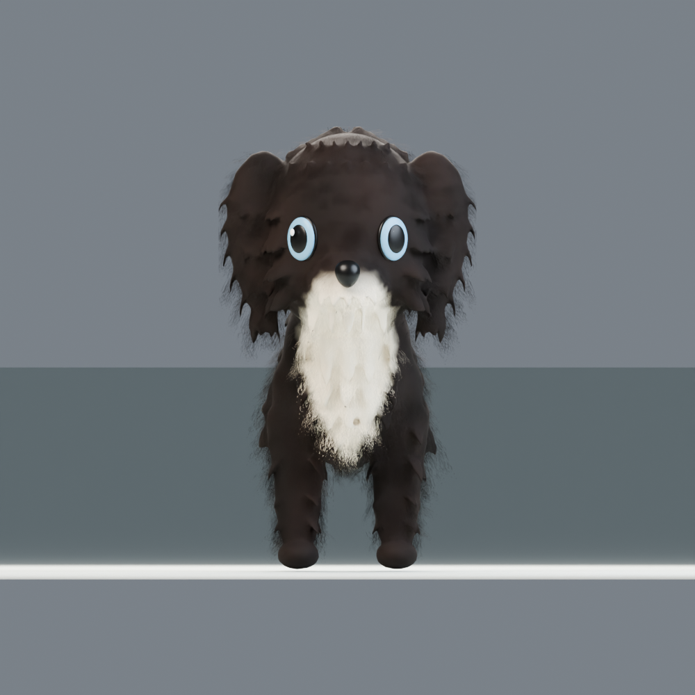
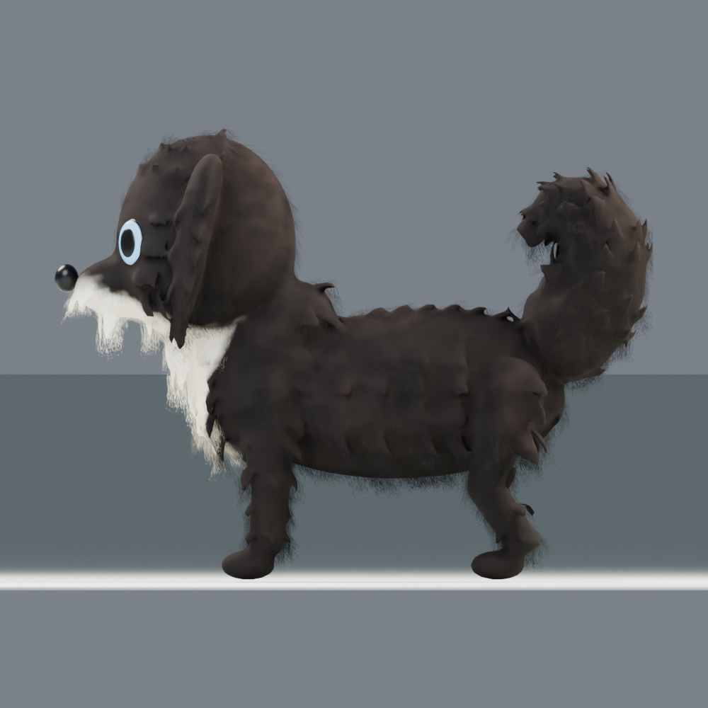
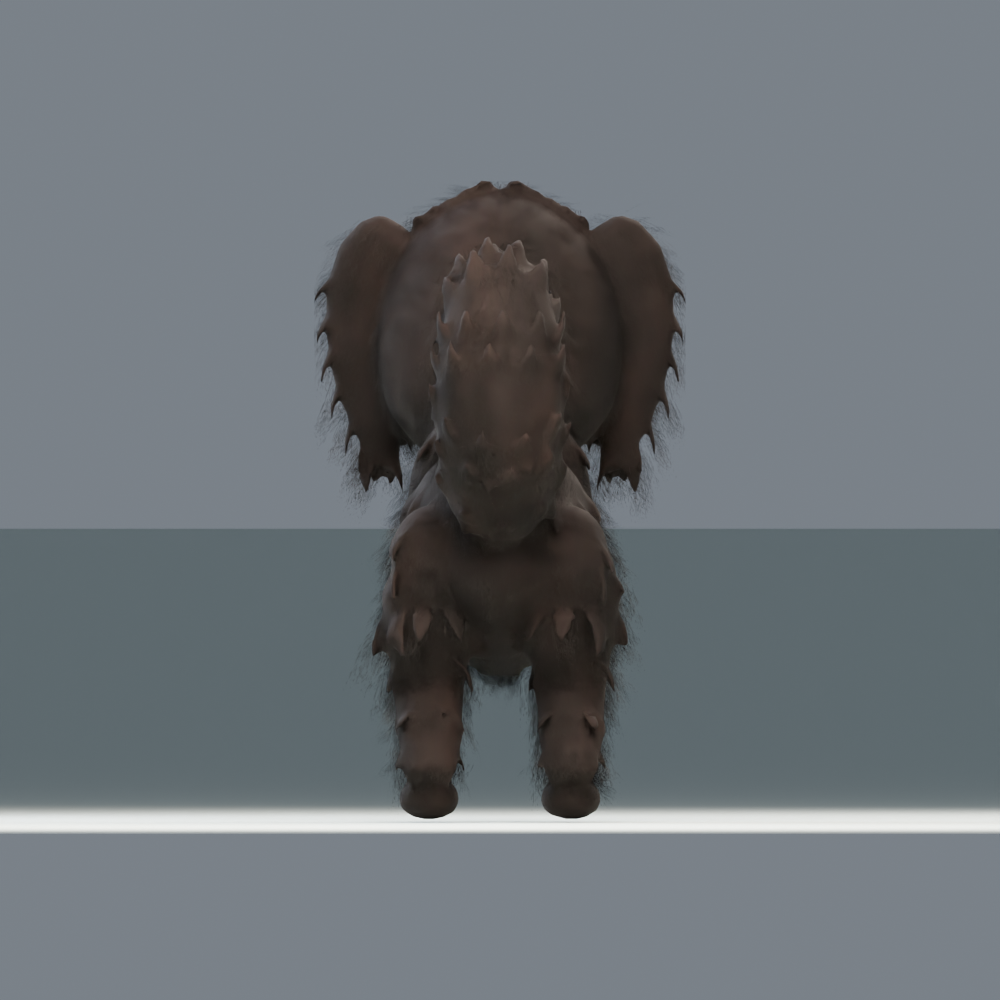

# 成年黑狗 v03 · 长毛剪影修订

本次只调整成年犬；幼犬继续使用 v02。v01、v02 文件保留，不覆盖旧模型。

## 交付与使用

- 游戏资产：`assets/models/black_dog/v03/adult_black_dog_v03.glb`。标准 glTF 2.0，贴图内嵌，已蒙皮。
- 可编辑源文件：`art_source/black_dog/v03/adult_black_dog_v03.blend`。
- MCP 导入检查场景：`art_source/black_dog/v03/black_dog_v03_review.blend`。
- Godot 预览：打开 `scenes/black_dog_3d_preview.tscn`，按 F6，再点击“成年”。不改 2D 游戏主场景。
- Godot 导入保留 `adult_black_dog_v03.glb.import` 与 `scripts/black_dog_import.gd`。细毛使用双面 Alpha Depth Pre-pass，避免硬裁切噪点；关闭自动 LOD、静态光照烘焙和顶点压缩。

## 本次修订

将两腮、耳缘、胸口、四肢与尾巴毛簇融合成连续的实体网格，再添加蒙皮细毛片。即使去掉细毛片，正侧面的毛簇起伏仍然存在。不是粒子毛，也不依赖 Blender 毛发模拟。

- 耳朵改为宽根、下垂、收尖的长叶形，追加正面及边缘毛簇。总宽固定，因此以增大下垂覆盖面积为主，未做 XYZ 三方向同时放大三倍。
- 尾巴加粗，保留上卷形态和六节蒙皮分段；毛片根部从尾巴表面取样，避免悬空碎片。
- 白毛从下巴延伸至胸口，边界带毛簇与渐变；不再是胸前一条小白线。
- 头部增加体量，腿缩短并加粗；蓝色凸面眼睛在侧视角也可见。

这仍是风格化的游戏模型修订版，不等同于原设定图的插画级写实长毛。毛簇形状及头脸表情可通过下方三视图继续审阅；不能以骨骼和导入测试通过，代替外形验收。

当前外形限制：胸口与躯干的实体毛簇仍有较硬的片状感，游戏强光下尤其明显；它不是已经通过美术验收的最终定稿。已修复摆尾时长条拉尖的问题，并保留原始诊断数值，不把权重归一化等同于没有形变失真。

## 尺寸与比例解释

静止姿态，包含实体毛与细毛片的整体包围盒：Blender **X 宽 0.427 m × Y 长 0.972 m × Z 高 0.733 m**。glTF/Godot 对应 X 宽、Y 高、Z 长。GLB 文件及 Godot 导入网格都执行尺寸断言。

建模过程中使用头部 1.18、眼睛 1.8、尾根直径 2.0 的局部调整参数，随后将网格与骨架一起适配固定总尺寸。**这些局部参数不是最终每个方向的净变化百分比**；各轴最后的适配倍率、腿部净垂直变化和骨名见 `proportion_validation.json`。固定包围盒优先，不宣称耳朵已在三个轴精确放大 2.5–3 倍。

## 骨架和游戏边界

保留原有 29 根骨骼的名称与父子关系，包含 `tail.00`—`tail.05`。为了匹配新体型，调整了骨骼静止位置及 bind pose，不能直接套用旧版 inverse bind matrices。每个顶点最多四个权重，权重归一化，无未绑定顶点。

带 `Idle`、`TailWag` 两段动作。GLB 与实际 Godot AnimationPlayer 检查骨骼位姿随播放发生变化。保留 FK 骨架；没有新增 IK、行走／奔跑动作、碰撞体或角色控制器。当前是可导入、可播放已有动作的美术资产，不是完整可操控角色。

面数与内嵌贴图统计见 `adult_mesh_validation.json`、`glb_validation.json`。阈值为 60,000 三角面以内，三个材质 surface；这是当前近景资产预算，尚无专门的移动端 LOD 或大量同屏性能测试。

## 配色

| 用途 | sRGB 基准 |
|---|---|
| 深毛 | `#1B1716` |
| 中间毛色 | `#3A2A24` |
| 毛色亮部参考 | `#5A3D2A` |
| 下巴与胸口 | `#E9DDC9` |
| 蓝色虹膜 | `#7FB6D8` |
| 鼻子及瞳孔 | `#0E0D0D` |

色值经过烘焙与光照显示，截图像素不等于材质 HEX。细毛还带亮度渐变。

## 实际渲染与验证





- `adult_beauty.png`：Blender 三分之四视角。
- `adult_silhouette_front.png`、`adult_silhouette_side.png`：去掉细毛片、保留实体毛簇的轮廓检查。
- `adult_pose_check.png`：头、耳、前腿、尾巴联合变形检查。
- `adult_godot_beauty.png`、`adult_godot_side.png`：Godot 实际运行截图，不是概念图。
- `godot_validation.json`：29 骨、蒙皮、材质与动作播放检查。
- `deformation_validation.json`：两段动作各七帧的实体网格边长变化。检查真实动作求值，99.9% 分位拉伸小于 2.5、单边净伸长小于 2.5 cm；微小边仍可能有较高比例，报告保留最大值。这是异常尖刺检查，不是所有动作的完整美术验收。

复现（Blender 5.0.1 / Godot 4.7.1）：

```text
blender --background --factory-startup --python-exit-code 1 --python scripts/build_black_dog_v03.py
python tests/validate_black_dog_glb.py
blender --background --factory-startup --python-exit-code 1 --python tests/validate_black_dog_v03_deformation.py
godot --headless --editor --import --quit
godot --headless --script res://tests/validate_black_dog_3d.gd --quit-after 120
godot --script res://tests/capture_black_dog_v03.gd --rendering-method gl_compatibility --quit-after 120
```

构建脚本只应在独立后台进程运行，会清空该进程的启动场景；依赖保留的 v02 成年 `.blend`，不修改它。交互中的 Blender 通过 MCP 新建独立 `BlackDog_V03_Delivery` 场景加载最终 GLB，已有场景保留。
